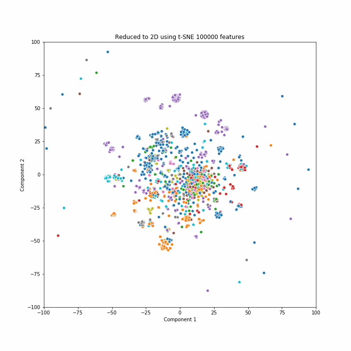
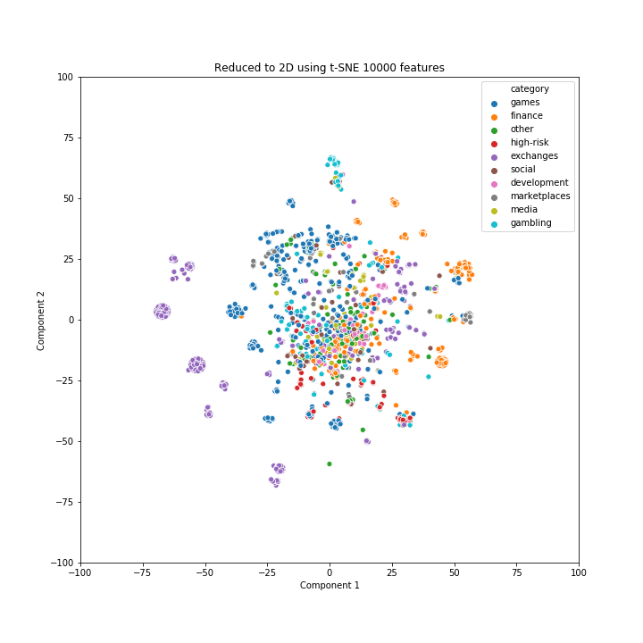

[](http://quantlet.de/)

## [](http://quantlet.de/) **CSC_Dapp_plotting** [](http://quantlet.de/)

```yaml

Name of Quantlet : CSC_Dapp_plotting

Published in : 'Classifying and Clustering Smart Contracts'

Description : 'Plotting DApps tSNE'

Keywords : 
 - smart-contracts
 - plot
 - visualization
 - ethereum
 - blockchain
 - tSNE

Author :  Elizaveta Zinovyeva, Raphael Constantin Georg Reule

Submitted :  Thu, Jul 16 2020 by Elizaveta Zinovyeva
```





### [IPYNB Code: CSC_Dapp_plotting.ipynb](CSC_Dapp_plotting.ipynb)


automatically created on 2020-07-16